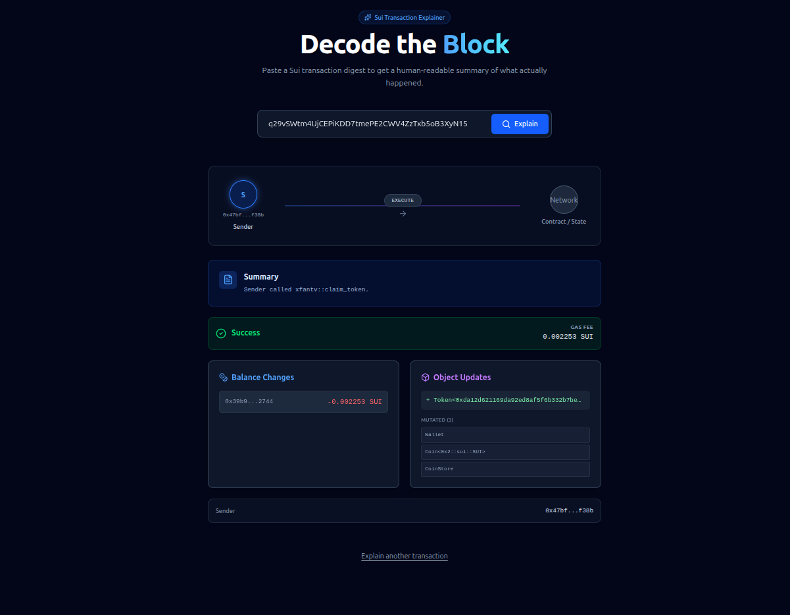
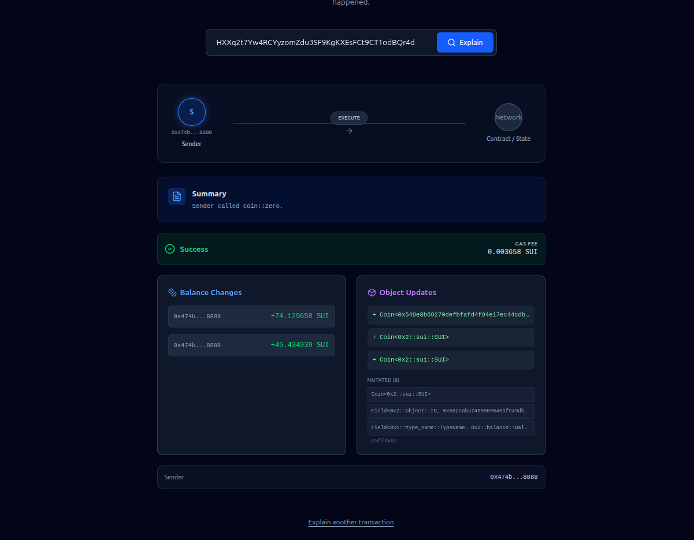
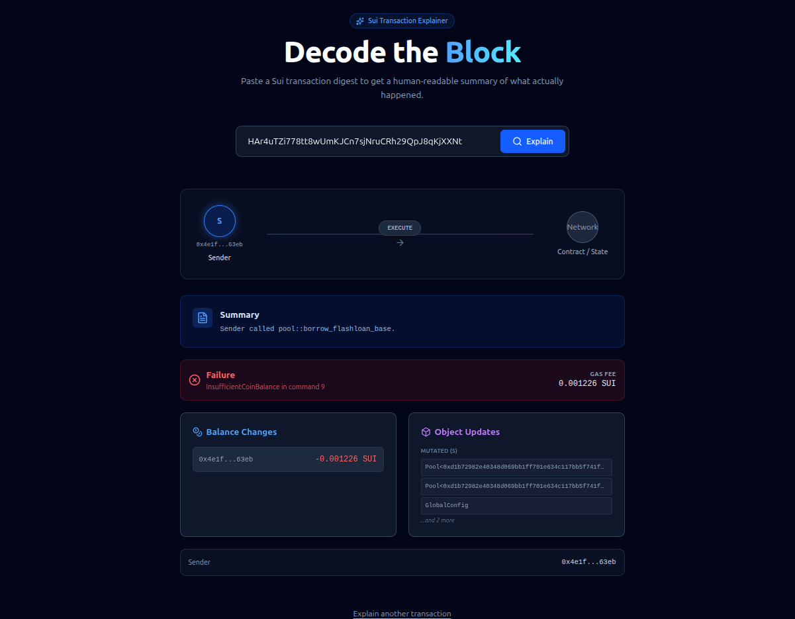

# Sui Transaction Explainer

A user-friendly web application that translates complex Sui blockchain transactions into plain English. Simply paste a transaction digest or explorer URL to see what happened—who sent what to whom, which objects were created or modified, and how much gas was consumed.

🔗 **[Live Demo](https://sui-tx-explainer.vercel.app/)**





---

## 🎯 Overview

This project was developed as part of the **Sui Request for Proposal Program** to address a common pain point: blockchain transactions are technically dense and difficult to understand. Our solution bridges that gap by providing:

- **Human-readable summaries** of complex blockchain operations
- **Visual representation** of asset flows and object mutations
- **Deep linking support** for seamless integration with Sui explorers
- **Instant feedback** for both successful and failed transactions

---

## ✨ Features

### Core Functionality

- **Smart Input Parsing**: Accepts transaction digests or full Sui Explorer URLs
- **Real-time Data Fetching**: Queries Sui Mainnet RPC for authoritative transaction details
- **AI-Powered Analysis (Preview)**:  
  _Integrates Groq LPU + Llama 3.3_ to provide experimental natural language explanations for complex transactions.
- **Intelligent Summarization**: Translates raw blockchain data into actionable insights:
  - _"Alice transferred NFT #1234 to Bob"_
  - _"2 new objects were created"_
  - _"Gas used: 0.015 SUI"_

### User Experience

- **Balance Change Analysis**: Net SUI flow calculated per address
- **Object Lifecycle Tracking**: Clear visualization of Created, Mutated, and Deleted objects
- **Move Call Identification**: Displays which smart contract functions were executed
- **Error Handling**: Graceful feedback for invalid inputs or failed transactions

---

## 🏗️ Architecture

### Current Implementation (MVP)

**Type:** Client-Side Single Page Application (SPA)

The application runs entirely in the browser with no custom backend required.

```
┌─────────────┐      JSON-RPC       ┌──────────────────┐
│             │ ──────────────────> │  Sui Public RPC  │
│             │ <────────────────── │   (Mainnet)      │
│   Browser   │                     └──────────────────┘
│  (React App)│      REST API       ┌──────────────────┐
│             │ ──────────────────> │     Groq API     │
│             │ <────────────────── │   (Llama 3.3)    │
└─────────────┘                     └──────────────────┘
```

**Data Flow:**

1. **Input Layer**: User submits a transaction digest or URL
2. **Data Layer**: `@mysten/sui` SDK queries `https://fullnode.mainnet.sui.io:443`
3. **Processing Layer**: Raw JSON parsed to extract:
   - Move function calls (e.g., `nft::mint`)
   - Balance changes (net SUI flow per address)
   - Object mutations (Created/Mutated/Deleted with cleaned type names)
4. **Presentation Layer**: React components render styled results using TailwindCSS

**Benefits:**

- ✅ Zero infrastructure costs (static hosting)
- ✅ Trustless architecture (direct chain verification)
- ✅ Simple deployment and maintenance
- ✅ No API keys or databases required

### Future Architecture (Scaling Phase)

For production deployments handling 10,000+ daily users:

```
┌─────────────┐     HTTPS      ┌──────────────┐    RPC     ┌─────────────┐
│   Browser   │ ────────────> │  BFF Server  │ ────────> │  Private    │
│             │ <──────────── │  + Cache     │ <──────── │  RPC Node   │
└─────────────┘    Enhanced    └──────────────┘   Chain    └─────────────┘
                   Response           │              Data
                                      ▼
                              ┌──────────────┐
                              │ Redis Cache  │
                              │  (Immutable  │
                              │ Tx Storage)  │
                              └──────────────┘
```

**Scaling Components:**

| Component                | Purpose                                               | Technology Options                 |
| ------------------------ | ----------------------------------------------------- | ---------------------------------- |
| **Backend-for-Frontend** | Proxy requests, enrich data, protect API keys         | Node.js, Go, Rust                  |
| **Caching Layer**        | Store immutable transaction data (90% cost reduction) | Redis, DynamoDB                    |
| **Dedicated RPC**        | Guaranteed uptime and throughput                      | Shinami, Mysten Labs, Google Cloud |
| **Metadata Service**     | Token names, logos, FIAT prices                       | Custom API + Database              |

**Comparison:**

| Aspect            | Current (MVP)       | Future (Production)        |
| ----------------- | ------------------- | -------------------------- |
| **Hosting**       | Static CDN (Vercel) | Containerized (Docker/K8s) |
| **Data Source**   | Public endpoint     | Private RPC + Cache        |
| **Cost**          | Free - $5/mo        | $100-500/mo                |
| **Response Time** | 1-3 seconds         | <100ms (cached)            |
| **Reliability**   | Best-effort         | 99.9% SLA                  |

---

## 🚀 Getting Started

### Prerequisites

- Node.js 18+ and npm/yarn
- Modern browser with JavaScript enabled

### Installation

1. **Clone the repository:**

   ```bash
   git clone https://github.com/yourusername/sui-tx-explainer.git
   cd sui-tx-explainer
   ```

2. **Install dependencies:**

   ```bash
   npm install
   ```

3. **Start development server:**

   ```bash
   npm run dev
   ```

4. **Build for production:**
   ```bash
   npm run build
   ```

### Project Structure

```
sui-tx-explainer/
├── src/
│   ├── lib/
│   │   └── sui.ts           # SuiClient initialization & RPC logic
│   ├── components/
│   │   ├── TxInput.tsx      # Digest/URL input handler
│   │   ├── TxVisualizer.tsx # Visual flow diagram
│   │   └── TxSummary.tsx    # Human-readable summary
│   └── assets/              # Screenshots & static files
├── dist/                    # Production build output
└── package.json
```

---

## 📦 Tech Stack

| Layer                  | Technology      | Purpose                               |
| ---------------------- | --------------- | ------------------------------------- |
| **Frontend Framework** | React 18 + Vite | Fast dev experience, optimized builds |
| **Styling**            | TailwindCSS v4  | Utility-first responsive design       |
| **Blockchain SDK**     | `@mysten/sui`   | Official Sui TypeScript SDK           |
| **Build Tool**         | Vite            | Lightning-fast HMR and bundling       |

---

## 🌐 Deployment

This is a static site compatible with all modern hosting platforms:

**Recommended Hosts:** Vercel, Netlify, Cloudflare Pages, GitHub Pages

**Configuration:**

- **Build Command:** `npm run build`
- **Output Directory:** `dist`
- **Node Version:** 18.x or higher

**Environment Variables:**

To enable the AI Preview mode, you must set the following environment variable in your Vercel/Netlify dashboard:

```env
VITE_GROQ_API_KEY=your_groq_api_key_here
```

_(Get a free key at [console.groq.com](https://console.groq.com))_

**Optional (Scaling):**

```env
VITE_SUI_RPC_URL=https://fullnode.mainnet.sui.io:443
```

---

## 📊 Data Source

**Current:** Public Sui Mainnet fullnode at `https://fullnode.mainnet.sui.io:443`

**Rate Limits:** No API key required for basic usage. For high-traffic applications, consider:

- [Shinami](https://www.shinami.com/) - Managed Sui infrastructure
- [Mysten Labs](https://mystenlabs.com/) - Official Sui services
- Self-hosted fullnode for complete control

**API Documentation:** [Sui JSON-RPC Reference](https://docs.sui.io/references/sui-api)

---

## 🗺️ Roadmap

### Phase 1: MVP ✅

- [x] Transaction digest parsing
- [x] Balance change calculation
- [x] Object mutation tracking
- [x] Basic visualization
- [x] Static deployment

### Phase 2: Enhanced UX (In Progress)

- [ ] Multi-transaction comparison
- [ ] Historical transaction search
- [ ] Export summaries as PDF/PNG
- [ ] Dark mode support

### Phase 3: Production Scaling

- [ ] Backend caching layer (Redis)
- [ ] Dedicated RPC provider integration
- [ ] Token metadata enrichment (logos, prices)
- [ ] Real-time transaction monitoring
- [ ] API for third-party integrations

---

## 🤝 Contributing

Contributions are welcome! This project is open source and community-driven.

**How to contribute:**

1. Fork the repository
2. Create a feature branch (`git checkout -b feature/amazing-feature`)
3. Commit your changes (`git commit -m 'Add amazing feature'`)
4. Push to the branch (`git push origin feature/amazing-feature`)
5. Open a Pull Request

**Development Guidelines:**

- Follow existing code style (Prettier + ESLint configured)
- Add tests for new features
- Update documentation as needed

---

## 📄 License

This project is licensed under the MIT License - see the [LICENSE](LICENSE) file for details.

---

## 🙏 Acknowledgments

- **Sui Foundation** for the RFP program support
- **Mysten Labs** for the excellent TypeScript SDK
- **Sui Community** for feedback and testing

---

## 📞 Support

- **Issues:** [GitHub Issues](https://github.com/yourusername/sui-tx-explainer/issues)
- **Discussions:** [GitHub Discussions](https://github.com/yourusername/sui-tx-explainer/discussions)

---
