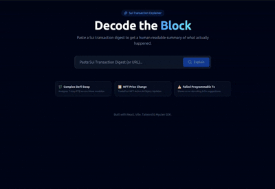

# Sui Decode - Transaction Explainer

> **"Decode the Block"** — A developer-friendly explorer that transforms raw Sui transaction data into human-readable insights.

**[Live Demo](https://sui-tx-explainer.vercel.app/)** | **[Report Bug](https://github.com/yourusername/sui-tx-explainer/issues)**

---

## 📖 Introduction

Sui Decode is a specialized block explorer designed to unravel the complexity of **Programmable Transaction Blocks (PTBs)** on the Sui network. Unlike standard explorers that dump raw JSON or low-level logs, Sui Decode focuses on **Semantic Understanding**—telling the story of _what_ happened, not just _how_ it executed.

It was built as a robust **Single Page Application (SPA)** using React and the official `@mysten/sui` SDK, enabling users to:

1.  **Visualize** complex asset flows (DeFi swaps, NFT trades).
2.  **Diagnose** failed transactions with clear error resolution.
3.  **Understand** high-level activities (Staking, Swapping) at a glance.

---

## 🎥 Showcase

<div align="center">
  <table width="100%">
    <!-- 1. Complex DeFi Swap (Full Width) -->
    <tr>
      <td colspan="2" align="center">
        <h3>1. Complex DeFi Swaps</h3>
        <p>Visualizes multi-hop programmable transaction flows in a single view.</p>
        
      </td>
    </tr>
    <!-- 2. Split View for NFT & Diagnostics -->
    <tr>
      <td align="center" width="50%">
        <h3>2. NFT Marketplace</h3>
        <p>Tracks object mutations & price changes.</p>
        
      </td>
      <td align="center" width="50%">
        <h3>3. Diagnostics</h3>
        <p>Instantly identifies failure reasons.</p>
        
      </td>
    </tr>
  </table>
</div>

---

## ⚡ Key Features

### 1. Interactive Transaction Visualizer

The core of the application. It parses linear PTB commands into a visual flow diagram.

- **Command Nodes**: Represents individual Move calls (e.g., `splitCoins`, `transferObjects`, `moveCall`).
- **Dependency Tracking**: Arrows indicate the flow of objects between commands.
- **Protocol Recognition**: Automatically identifies known protocols (e.g., Cetus, DeepBook) via package IDs.

### 2. "Twitter-Style" Activity Feed

Raw event logs are often noisy. We implemented a parsing layer that filters and maps events to human-readable "Activities":

- `0x...::pool::swap` → **"Swapped Coin A for Coin B"**
- `0x...::staking::request` → **"Staked SUI"**
- Includes "Show More/Less" toggles for density management.

### 3. Smart Object & Balance Tracking

- **Balance Changes**: Visualized with color-coded rows (Green for In, Red for Out) and formatted generic coin types (e.g., `Coin<SUI>`).
- **Object Lifecycle**: Tracks `Created`, `Mutated`, `Deleted`, and `Wrapped` objects with distinct "Badge" styles for quick scanning.

### 4. Diagnostic Error Handling

When a transaction fails, Sui Decode doesn't just say "Failure". It:

- Extracts the specific **Move Abort Code**.
- Highlights the exact **Command Index** that caused the failure.
- Provides context (e.g., "Insufficient Coin Balance").

---

## 🏗️ Technical Architecture & Engineering Decisions

This project solves several specific engineering challenges related to blockchain data visualization.

### 1. "Clean URL" State Management

We implemented a hybrid routing pattern to support both **Deep Linking** and **Clean Resets**.

- **Challenge**: Storing state in the URL (`?digest=...`) is great for sharing, but bad for application reset. Hitting "Refresh" typically reloads the stale transaction.
- **Solution**:
  1.  **On Mount**: The app checks `window.location.search` for a digest.
  2.  **Fetch & Purge**: Immediately after initiating the data fetch, we call `window.history.replaceState({}, '', '/')`.
  3.  **Result**: The user sees the transaction data, but the URL is clean. Hitting "Refresh" acts as a true "Reset" to the home screen.
  4.  **Sharing**: The "Share Result" button manually constructs the deep link (`domain.com/?digest=...`) for clipboard copying.

### 2. Robust Visualizer Layout (Flexbox vs Absolute)

Rendering infinite horizontal flows in a responsive container is non-trivial. Early iterations using absolute positioning led to clipping issues on overflow. We refuted to a **Flexbox Parent-Child** architecture:

```tsx
// Outer Container: Manages Scroll & Padding
<div className="w-full overflow-x-auto custom-scrollbar px-8">
  {/* Inner Container: Forces Width */}
  <div className="flex items-center gap-4 min-w-max">
    {commands.map((cmd) => (
      <CommandBlock />
    ))}
  </div>
</div>
```

- **`min-w-max`**: Critical for ensuring the inner container expands to fit _all_ children, preventing the "clipped arrow" bug on the right edge.
- **`px-8`**: Applied to the scroll owner to ensure breathing room at the start/end of the flow.

### 3. Data Normalization & Type Safety

Sui's JSON-RPC responses are nested and complex. We built a normalization layer (`src/lib/sui.ts`) that leverages the strict typing from `@mysten/sui/client`:

- **Strict Mode Fetch**: We use `getTransactionBlock` with specific flags (`showBalanceChanges`, `showEffects`, `showInput`, `showObjectChanges`) to minimize payload size while ensuring all necessary visual data is present.
- **Protocol Mapping**: We maintain a registry in `src/lib/protocols.ts` that maps Package IDs to protocol metadata (Name, Icon). This decoupling allows for easy addition of new protocols without touching UI code.
- **Safe Parsing**: All balance calculations use `BigInt` to prevent precision loss with SUI's 9-decimal precision.

---

## 📂 Project Structure

```bash
sui-tx-explainer/
├── src/
│   ├── components/
│   │   ├── TxInput.tsx       # Search bar with validation & reset logic
│   │   ├── TxVisualizer.tsx  # Flow diagram engine (Flexbox layout)
│   │   ├── TxSummary.tsx     # Accordions for Balance/Objects
│   │   └── TxActivity.tsx    # Semantic event parser
│   ├── lib/
│   │   ├── sui.ts            # RPC Client & Data Fetching
│   │   ├── utils.ts          # Formatters (Address, Balance)
│   │   └── protocols.ts      # Protocol Registry (Package ID Map)
│   └── App.tsx               # Main State Controller
└── index.html                # Entry point (Inter Font injection)
```

---

## 🚀 Getting Started

### Prerequisites

- Node.js 18+
- npm or yarn

### Installation

1.  **Clone the repository**

    ```bash
    git clone https://github.com/yourusername/sui-tx-explainer.git
    cd sui-tx-explainer
    ```

2.  **Install Dependencies**

    ```bash
    npm install
    ```

3.  **Run Development Server**

    ```bash
    npm run dev
    ```

4.  **Build for Production**
    ```bash
    npm run build
    ```

---

## 🤝 Roadmap & Future Improvements

- **Wallet Integration**: Connect wallet to view personal transaction history.
- **Mainnet/Testnet Toggle**: Switch between networks for debugging.
- **Visualizer V2**: Support for nested inputs and complex Merge/Split flows.
- **Dark/Light Mode**: Full theme support.

---

---

## ✅ RFP Deliverables & Scope

This project was built to specifically address the **Sui Transaction Explainer** RFP. Below is the feature-to-requirement mapping:

| RFP Requirement                 |     Status      | Implementation Details                                                       |
| :------------------------------ | :-------------: | :--------------------------------------------------------------------------- |
| **User-Friendly Web App**       |   ✅ **Done**   | Polished React SPA with Inter font, responsive layout, and "Genuine" design. |
| **Fetch Transaction Details**   |   ✅ **Done**   | Real-time fetching via `@mysten/sui` RPC client (standard & clean).          |
| **Human-Readable Summaries**    |   ✅ **Done**   | "Twitter-style" feed (e.g., "Swapped Coin A for Coin B") replacing raw logs. |
| **Visual Flow (Optional)**      | 🚀 **Exceeded** | Full interactive visualizer node graph for Programmable Transaction Blocks.  |
| **Gas & Object Context**        |   ✅ **Done**   | Approximate USD gas conversion + Clear "Created/Mutated" object badges.      |
| **"Explain Another" (Stretch)** |   ✅ **Done**   | One-click reset button in the sticky header for rapid demos.                 |

---

## 📄 License

MIT
